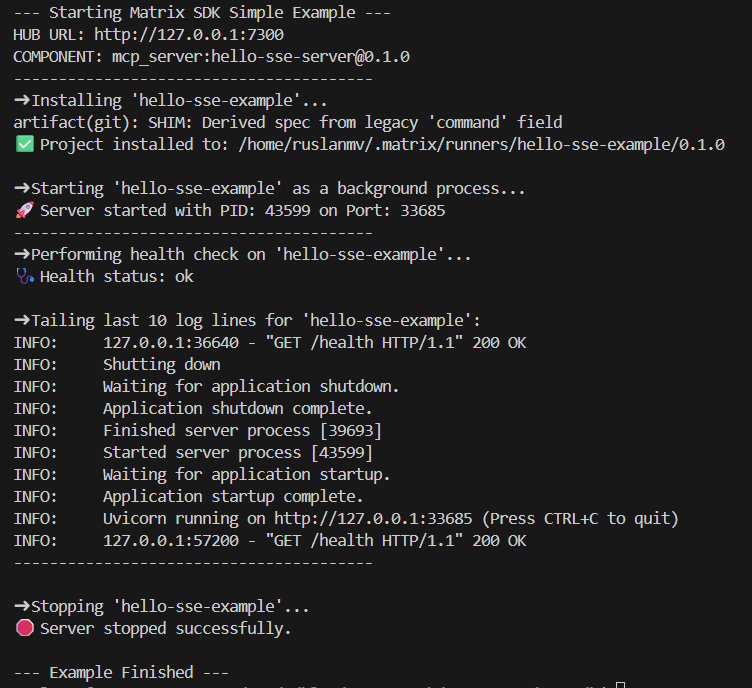

# API Reference

> SDK version: **0.1.2**
> Scope: Hub catalog client + local installer + lightweight runtime

This SDK provides three pillars:

1. **MatrixClient** — search the Hub, read entities, request install plans.
2. **LocalInstaller** — materialize a plan locally (files, artifacts, env, `runner.json`).
3. **runtime** — start/stop/list/tail/doctor local MCP servers (no daemon).

> New in **0.1.2**: `matrix_sdk.search` — thin, defensive wrappers around `/catalog/search` with normalization, retries, and optional mode fallbacks.

---

## MatrixClient

**Location**: `matrix_sdk.client.MatrixClient`
**Errors**: raises `matrix_sdk.client.MatrixError(status, detail)` on non-2xx.

```python
class MatrixClient:
    def __init__(self, base_url: str, token: str | None = None, *,
                 timeout: float = 15.0, **kwargs) -> None: ...

    # Catalog
    def search(self, q: str, *,
               type: str | None = "any",
               limit: int = 10,
               capabilities: str | None = None,
               frameworks: str | None = None,
               providers: str | None = None,
               mode: str | None = None,
               include_pending: bool = False,
               with_snippets: bool = False,
               with_rag: bool = False,
               rerank: str | None = "none") -> dict: ...
    def entity(self, id: str) -> dict: ...
    def install(self, id: str, *, target: str, **kwargs) -> dict: ...

    # Remotes
    def list_remotes(self) -> list | dict: ...
    def add_remote(self, url: str, *, name: str | None = None) -> dict: ...
    def delete_remote(self, name: str) -> dict: ...
    def trigger_ingest(self, name: str) -> dict: ...
```

**Notes**

* `entity(id)` URL-encodes `id` internally.
* `install(id, target)` calls Hub `/catalog/install` and returns the Hub payload (plan/results/etc).
* Treat `type="any"` (or `None`) as “no filter”.

---

## Deep links

**Location**: `matrix_sdk.deep_link`
**Errors**: `InvalidMatrixUri` for bad/unsupported URIs.

```python
from matrix_sdk.deep_link import parse, handle_install, InvalidMatrixUri

dl = parse("matrix://install?id=tool%3Ahello%400.1.0&alias=hello")
# -> DeepLink(action='install', id='tool:hello@0.1.0', alias='hello')

res = handle_install(url, client, target="/abs/install/dir")
# -> HandleResult(id=..., target=..., response=<hub install payload>)
```

Rules:

* Only `matrix://install` is supported.
* `id` is **required**; `alias` matches `^[a-z0-9][a-z0-9._-]{0,63}$`.

---

## LocalInstaller

**Location**: `matrix_sdk.installer.LocalInstaller`
**Data classes**: `BuildReport`, `EnvReport`, `BuildResult`
**Other errors**: `matrix_sdk.manifest.ManifestResolutionError`, `ArchiveFetchError`, `GitFetchError`.

```python
from matrix_sdk.installer import LocalInstaller

installer = LocalInstaller(client)

result = installer.build(
    "mcp_server:hello-sse-server@0.1.0",
    alias="hello-sse",
    # target defaults via policy if omitted
)

print(result.target)         # install directory
print(result.env.python_prepared, result.env.node_prepared)
print(result.build.files_written, result.build.artifacts_fetched)
print(result.runner)         # contents of runner.json (dict)
```

### Lifecycle

1. **plan(id, target)** → ask Hub for an install plan.
2. **materialize(outcome, target)** → write declared files, fetch artifacts, ensure/validate `runner.json`.
3. **prepare\_env(target, runner)** → create `.venv` (Python) and/or run `npm|yarn|pnpm install` (Node).
4. **build(id, …)** → runs all three steps and returns `BuildResult`.

**Runner inference** (when missing):

* If `server.py` → `{"type":"python","entry":"server.py","python":{"venv":".venv"}}`
* If `server.js`/`package.json` → Node with sensible default entry.

---

## runtime

**Location**: `matrix_sdk.runtime`
**State/Logs**: `~/.matrix/state/<alias>/runner.lock.json`, `~/.matrix/logs/<alias>.log`
**Model**: `LockInfo(pid:int, port:int|None, alias:str, target:str, started_at:float, runner_path:str)`

```python
from matrix_sdk import runtime

lock = runtime.start("/path/to/install", alias="hello-sse")   # reads runner.json
# uses venv python for python runners; finds a free port if needed

runtime.status()              # -> list[LockInfo]
runtime.doctor("hello-sse")   # -> {"status": "ok"|"fail", "reason": "..."}
runtime.stop("hello-sse")     # -> bool
for line in runtime.tail_logs("hello-sse", n=40): print(line, end="")
runtime.log_path("hello-sse") # -> str
```

**Requirements**

* `runner.json` must define at least: `{"type": "python"|"node", "entry": "…"}`
* Python runners: venv Python must exist (created during `prepare_env`).

---

## Artifact fetchers

### HTTP archives

**Location**: `matrix_sdk.archivefetch`
**API**:

```python
from matrix_sdk.archivefetch import fetch_http_artifact, ArchiveFetchError

fetch_http_artifact(
    url: str,
    target: pathlib.Path | str,
    dest: str | None = None,        # optional: also save raw file at target/dest
    sha256: str | None = None,      # optional integrity
    unpack: bool = False,           # auto-detects .zip/.tar(.gz) too
    timeout: int | float = 60,
    logger: logging.Logger | None = None,
)
```

* Safe ZIP/TAR extraction (no path traversal).
* Optional flatten of GitHub-style single-folder archives.

### Git repos

**Location**: `matrix_sdk.gitfetch`
**API**:

```python
from matrix_sdk.gitfetch import fetch_git_artifact, GitFetchError

fetch_git_artifact(
    spec: Mapping[str, object],     # {repo, ref, depth?, subdir?, strip_vcs?, recurse_submodules?, lfs?, verify_sha?}
    target: pathlib.Path,
    git_bin: str = "git",
    allow_hosts: Iterable[str] | None = None,  # defaults via env/standard hosts
    timeout: int = 180,
    logger: logging.Logger | None = None,
)
```

* HTTPS by default; host allow-list enforced (deny-by-default if none given).
* Shallow clone, optional sparse subdir, optional LFS, optional commit verification.

---

## Schemas (Pydantic)

**Location**: `matrix_sdk.schemas`
Models mirror Hub responses; unknown fields are allowed.

* `SearchItem`, `SearchResponse`
* `EntityDetail` (extra fields allowed; includes manifest-ish + computed fields)
* `InstallStepResult`, `InstallOutcome`
* `MatrixAPIError` (generic error wrapper)

---

## Exceptions

* `matrix_sdk.client.MatrixError(status, detail)` — Hub non-2xx.
* `matrix_sdk.deep_link.InvalidMatrixUri` — deep-link parse/validation errors.
* `matrix_sdk.manifest.ManifestResolutionError` — manifest/artifact integrity/host violations.
* `matrix_sdk.archivefetch.ArchiveFetchError` — download/unpack errors.
* `matrix_sdk.gitfetch.GitFetchError` — git materialization errors.

---

## Environment variables

* `MATRIX_SDK_DEBUG=1` — verbose logs for installer/runtime/archivefetch/search.
* `MATRIX_HOME` — base dir for `~/.matrix` (state/logs).
* `MATRIX_GIT_ALLOWED_HOSTS` — CSV allow-list for git fetch (defaults to common hosts if not provided via API).
* `MATRIX_GIT_ALLOW_INSECURE=1` — allow `http://` git (discouraged).
* `MATRIX_SDK_DEBUG_GIT=1` — extra git logs.

---

## End-to-end example

```python
from matrix_sdk.client import MatrixClient
from matrix_sdk.installer import LocalInstaller
from matrix_sdk import runtime

# 1. Initialize the client and installer
client = MatrixClient(base_url="http://127.0.0.1:7300")
installer = LocalInstaller(client)

# 2. Build the project locally
result = installer.build("mcp_server:hello-sse-server@0.1.0", alias="my-server")
print(f"✅ Project installed to: {result.target}")

# 3. Start the server using the runtime module
server = runtime.start(result.target, alias="my-server")
print(f"🚀 Server started with PID {server.pid} on port {server.port}")

# 4. Check status and stop the server
print(f"ℹ️ Current status: {runtime.status()}")
runtime.stop("my-server")
print("🛑 Server stopped.")
```



---

## Search

**Location**: `matrix_sdk.search`
**Purpose**: Thin, defensive wrappers around `GET /catalog/search` with normalization, small retries, and optional mode fallbacks.

```python
from matrix_sdk.search import search, search_try_modes, SearchOptions
```

### `search(...)`

```python
def search(
    client: "MatrixClient",
    q: str,
    *,
    type: str | None = None,                           # "agent" | "tool" | "mcp_server" | "any"/None
    capabilities: "Iterable[str] | str | None" = None, # list/tuple/set or CSV -> CSV
    frameworks: "Iterable[str] | str | None" = None,   # list/tuple/set or CSV -> CSV
    providers: "Iterable[str] | str | None" = None,    # list/tuple/set or CSV -> CSV
    mode: str | None = "hybrid",                       # "keyword" | "semantic" | "hybrid"
    limit: int = 5,                                    # clamped to 1..100
    with_rag: bool = False,                            # add fit_reason if supported
    with_snippets: bool = False,                       # add snippet if supported
    rerank: str | None = "none",                       # "none" | "llm"
    include_pending: bool = False,
    options: "SearchOptions | None" = None,            # retries, fallbacks, typed return
) -> dict | "SearchResponse": ...
```

**Behavior**

* Normalizes filters (lists/sets → CSV), clamps `limit`.
* Retries transient 5xx/network errors with exponential backoff.
* Optional **fallback chain** across modes (e.g., semantic → hybrid → keyword) when no results.
* Returns a `dict` by default, or a typed `SearchResponse` if `options.as_model=True`.

**Example**

```python
from matrix_sdk.client import MatrixClient
from matrix_sdk.search import search, SearchOptions

hub = MatrixClient("http://127.0.0.1:7300")

# Hybrid with fallbacks; typed response
res = search(
    hub, "hello world", type="mcp_server",
    options=SearchOptions(as_model=True, max_attempts=3)
)
print(res.total, [it.id for it in res.items])
```

### `SearchOptions`

```python
from dataclasses import dataclass
from typing import Tuple

@dataclass(frozen=True)
class SearchOptions:
    allow_fallback: bool = True                         # try more modes when no results
    fallback_order: "Tuple[str, ...] | None" = None     # override mode order
    max_attempts: int = 2                               # transient retry attempts
    backoff_base: float = 0.1                           # seconds; jittered exponential
    as_model: bool = False                              # return pydantic SearchResponse
```

**Defaults**

* If `fallback_order` is not provided, the helper picks a sensible chain based on the initial `mode`.
* `max_attempts` applies to each HTTP attempt (initial + each fallback).

### `search_try_modes(...)`

```python
def search_try_modes(
    client: "MatrixClient",
    q: str,
    modes: "Sequence[str]" = ("hybrid", "keyword", "semantic"),
    **kwargs,
):
    """Yield (mode, response) for each mode (no fallbacks)."""
    ...
```

---

**Removed in 0.1.2**: *none* (no public APIs were deprecated or removed since 0.1.1; this release **adds** the `matrix_sdk.search` helper and extends `MatrixClient.search` to support `with_rag` and `rerank` parameters).\_
