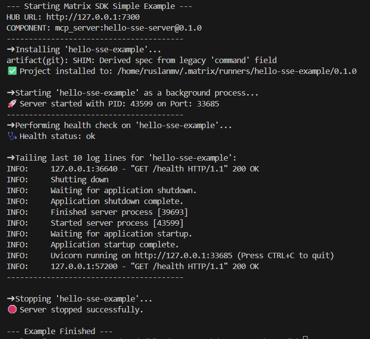

# API Reference

> SDK version: **0.1.9**
> Scope: Hub catalog client • local installer (files, artifacts, env, runner discovery) • lightweight runtime

This SDK provides three pillars:

1. **MatrixClient** — search the Hub, read entities, request install plans.
2. **LocalInstaller** — materialize a plan locally (files, artifacts, env, `runner.json`).
3. **runtime** — start/stop/list/tail/doctor local MCP servers (no daemon).

> New in **0.1.9**
>
> * The installer has been refactored into a proper subpackage: `matrix_sdk/installer/`.
> * Backwards-compatible import: **`from matrix_sdk.installer import LocalInstaller` still works**.
> * More robust runner discovery (URLs, embedded manifests, shallow search, structural inference).
> * Environment prep parity with the legacy installer (Python venv + pip indices, Node PM autodetect).
> * New/expanded env toggles (see **Environment variables**).

---

## MatrixClient

**Location**: `matrix_sdk.client.MatrixClient`
**Errors**: raises `matrix_sdk.client.MatrixError(status, detail)` on non-2xx.

```python
class MatrixClient:
    def __init__(
        self,
        base_url: str,
        token: str | None = None,
        *,
        timeout: float = 15.0,
        **kwargs
    ) -> None: ...

    # Catalog
    def search(
        self,
        q: str,
        *,
        type: str | None = "any",
        limit: int = 10,
        capabilities: str | None = None,
        frameworks: str | None = None,
        providers: str | None = None,
        mode: str | None = None,
        include_pending: bool = False,
        with_snippets: bool = False,
        with_rag: bool = False,
        rerank: str | None = "none",
    ) -> dict: ...

    def entity(self, id: str) -> dict: ...
    def install(self, id: str, *, target: str, **kwargs) -> dict: ...

    # Remotes
    def list_remotes(self) -> list | dict: ...
    def add_remote(self, url: str, *, name: str | None = None) -> dict: ...
    def delete_remote(self, name: str) -> dict: ...
    def trigger_ingest(self, name: str) -> dict: ...
```

**Notes**

* `entity(id)` URL-encodes `id` internally.
* `install(id, target)` calls Hub `/catalog/install` and returns the Hub payload (plan/results/etc).
* Treat `type="any"` (or `None`) as “no filter”.

---

## Deep links

**Location**: `matrix_sdk.deep_link`
**Errors**: `InvalidMatrixUri` for bad/unsupported URIs.

```python
from matrix_sdk.deep_link import parse, handle_install, InvalidMatrixUri

dl = parse("matrix://install?id=tool%3Ahello%400.1.0&alias=hello")
# -> DeepLink(action='install', id='tool:hello@0.1.0', alias='hello')

res = handle_install(url, client, target="/abs/install/dir")
# -> HandleResult(id=..., target=..., response=<hub install payload>)
```

Rules:

* Only `matrix://install` is supported.
* `id` is **required**; `alias` must match `^[a-z0-9][a-z0-9._-]{0,63}$`.

---

## LocalInstaller

**Location**: `matrix_sdk.installer.LocalInstaller`
**Data classes**: `BuildReport`, `EnvReport`, `BuildResult`
**Other errors**: `matrix_sdk.manifest.ManifestResolutionError`, `ArchiveFetchError`, `GitFetchError`.

```python
from matrix_sdk.installer import LocalInstaller

installer = LocalInstaller(client)

result = installer.build(
    "mcp_server:hello-sse-server@0.1.0",
    alias="hello-sse",
    # target defaults via policy if omitted
)

print(result.target)         # install directory
print(result.env.python_prepared, result.env.node_prepared)
print(result.build.files_written, result.build.artifacts_fetched)
print(result.runner)         # contents of runner.json (dict)
```

### Public dataclasses (exact fields)

```python
from dataclasses import dataclass
from typing import Any, Dict, Optional

@dataclass(frozen=True)
class BuildReport:
    files_written: int
    artifacts_fetched: int
    runner_path: Optional[str]

@dataclass(frozen=True)
class EnvReport:
    python_prepared: bool
    node_prepared: bool
    notes: Optional[str] = None

@dataclass(frozen=True)
class BuildResult:
    id: str
    target: str
    plan: Dict[str, Any]
    build: BuildReport
    env: EnvReport
    runner: Dict[str, Any]
```

### Lifecycle

1. **`plan(id, target)`** → ask Hub for an install plan
   *Sends a server-safe target label by default (e.g. `alias/version`). Use `MATRIX_INSTALL_SEND_ABS_TARGET=true` to send the absolute path.*

2. **`materialize(outcome, target)`** → write declared files, fetch artifacts, ensure/validate `runner.json`
   *Scans `plan.files`, `results[].files`, and top-level `files`. Supports `content` (text) and `content_b64` (binary).*

3. **`prepare_env(target, runner)`** → create `.venv` (Python) and/or run `pnpm|yarn|npm install` (Node)
   *Python: upgrades pip/setuptools/wheel; respects pip index envs; installs from `runner.python.requirements`, `requirements.txt`, or local project (`pyproject.toml` / `setup.py`) with optional editable mode. Node: auto-detects package manager from lockfiles unless overridden.*

4. **`build(id, …)`** → runs all three steps and returns `BuildResult`.

### Methods (signatures & behavior)

```python
class LocalInstaller:
    def __init__(self, client: MatrixClient, *, fs_root: str | Path | None = None): ...

    def plan(self, id: str, target: str | os.PathLike[str]) -> dict: ...
    # Sends server-safe label unless MATRIX_INSTALL_SEND_ABS_TARGET=true

    def materialize(self, outcome: dict, target: str | os.PathLike[str]) -> BuildReport: ...
    # Writes files, fetches artifacts, and writes runner.json via discovery chain

    def prepare_env(
        self,
        target: str | os.PathLike[str],
        runner: dict,
        *,
        timeout: int = 900
    ) -> EnvReport: ...
    # Python venv + pip install and/or Node install

    def build(
        self,
        id: str,
        *,
        target: str | os.PathLike[str] | None = None,
        alias: str | None = None,
        timeout: int = 900
    ) -> BuildResult: ...

    def _load_runner_from_report(self, report: BuildReport, target_path: Path) -> dict: ...
    # Prefers report.runner_path, falls back to target/runner.json
```

### Runner discovery (strategy order)

The installer uses a deterministic chain and stops at the first valid result:

1. `plan.runner_b64` → decode → validate → write
2. `plan.runner_url` (relative resolved against provenance) → fetch JSON → validate → write
3. `plan.runner` (object) → validate → write
4. Embedded manifest (v2): `manifest.runner` → validate → write
5. Embedded manifest (v1): extract server URL → synthesize **connector** runner (`/sse`) → write
6. Local file: `runner_file` or `runner.json`
7. Shallow BFS for `runner.json` (depth = `MATRIX_SDK_RUNNER_SEARCH_DEPTH`, default **2**)
8. Manifest URL (`plan.manifest_url` or `provenance.source_url`), when `MATRIX_SDK_ALLOW_MANIFEST_FETCH=true`: fetch → parse → synthesize connector → write
9. Structural inference: infer minimal `python`/`node` runner from files (e.g., `server.py`, `package.json`) → write
10. Last-ditch: if *any* MCP/SSE URL hint is present, synthesize a minimal connector

> A valid **process** runner must include `"entry"` and `"type": "python"|"node"`.
> A valid **connector** runner must include `"type": "connector"` and `"url"`.

---

## runtime

**Location**: `matrix_sdk.runtime`
**State/Logs**: `~/.matrix/state/<alias>/runner.lock.json`, `~/.matrix/logs/<alias>.log`
**Model**: `LockInfo(pid:int, port:int|None, alias:str, target:str, started_at:float, runner_path:str)`

```python
from matrix_sdk import runtime

lock = runtime.start("/path/to/install", alias="hello-sse")  # reads runner.json
# uses venv python for python runners; finds a free port if needed

runtime.status()              # -> list[LockInfo]
runtime.doctor("hello-sse")   # -> {"status": "ok"|"fail", "reason": "..."}
runtime.stop("hello-sse")     # -> bool
for line in runtime.tail_logs("hello-sse", n=40): print(line, end="")
runtime.log_path("hello-sse") # -> str
```

**Requirements**

* `runner.json` must define at least: `{"type": "python"|"node", "entry": "…"}`
* Python runners: venv Python must exist (created during `prepare_env`).

---

## Artifact fetchers

### HTTP archives

**Location**: `matrix_sdk.archivefetch`
**API**:

```python
from matrix_sdk.archivefetch import fetch_http_artifact, ArchiveFetchError

fetch_http_artifact(
    url: str,
    target: pathlib.Path | str,
    dest: str | None = None,        # optional: also save raw file at target/dest
    sha256: str | None = None,      # optional integrity
    unpack: bool = False,           # auto-detects .zip/.tar(.gz) too
    timeout: int | float = 60,
    logger: logging.Logger | None = None,
)
```

* Safe ZIP/TAR extraction (no path traversal).
* Optional flatten of GitHub-style single-folder archives.

### Git repos

**Location**: `matrix_sdk.gitfetch`
**API**:

```python
from matrix_sdk.gitfetch import fetch_git_artifact, GitFetchError

fetch_git_artifact(
    spec: Mapping[str, object],     # {repo, ref, depth?, subdir?, strip_vcs?, recurse_submodules?, lfs?, verify_sha?}
    target: pathlib.Path,
    git_bin: str = "git",
    allow_hosts: Iterable[str] | None = None,  # defaults via env/standard hosts
    timeout: int = 180,
    logger: logging.Logger | None = None,
)
```

* HTTPS by default; host allow-list enforced (deny-by-default if none given).
* Shallow clone, optional sparse subdir, optional LFS, optional commit verification.

---

## Schemas (Pydantic)

**Location**: `matrix_sdk.schemas`
Models mirror Hub responses; unknown fields are allowed.

* `SearchItem`, `SearchResponse`
* `EntityDetail` (extra fields allowed; includes manifest-ish + computed fields)
* `InstallStepResult`, `InstallOutcome`
* `MatrixAPIError` (generic error wrapper)

---

## Exceptions

* `matrix_sdk.client.MatrixError(status, detail)` — Hub non-2xx.
* `matrix_sdk.deep_link.InvalidMatrixUri` — deep-link parse/validation errors.
* `matrix_sdk.manifest.ManifestResolutionError` — manifest/artifact integrity/host violations.
* `matrix_sdk.archivefetch.ArchiveFetchError` — download/unpack errors.
* `matrix_sdk.gitfetch.GitFetchError` — git materialization errors.

---

## Environment variables

General

| Variable                         | Meaning                                                                           | Default   |
| -------------------------------- | --------------------------------------------------------------------------------- | --------- |
| `MATRIX_SDK_DEBUG`               | Enables verbose DEBUG logging for installer/runtime/archivefetch.                 | off       |
| `MATRIX_HOME`                    | Base dir for `~/.matrix` (state/logs).                                            | user home |
| `MATRIX_INSTALL_SEND_ABS_TARGET` | Send absolute install path to Hub during `plan()` (instead of server-safe label). | off       |

Installer — runner discovery

| Variable                          | Meaning                                                             | Default     |
| --------------------------------- | ------------------------------------------------------------------- | ----------- |
| `MATRIX_SDK_RUNNER_SEARCH_DEPTH`  | Depth for shallow `runner.json` search.                             | `2`         |
| `MATRIX_SDK_ALLOW_MANIFEST_FETCH` | Permit fetching a remote manifest to synthesize a connector runner. | `1`         |
| `MATRIX_SDK_MANIFEST_DOMAINS`     | CSV allow-list of domains allowed for remote manifest fetches.      | (allow all) |
| `MATRIX_SDK_ENABLE_CONNECTOR`     | Allow synthesizing connector runners from URL hints.                | `1`         |
| `MATRIX_SDK_HTTP_TIMEOUT`         | Network timeout (seconds) for installer fetches.                    | `15`        |

Installer — Python deps

| Variable                         | Meaning                                                 | Default     |
| -------------------------------- | ------------------------------------------------------- | ----------- |
| `MATRIX_SDK_PIP_INDEX_URL`       | Primary pip index URL.                                  | pip default |
| `MATRIX_SDK_PIP_EXTRA_INDEX_URL` | Extra pip index URL.                                    | none        |
| `MATRIX_SDK_PIP_EDITABLE`        | Install local project as editable (`pip install -e .`). | `1`         |

Git fetcher

| Variable                    | Meaning                             | Default      |
| --------------------------- | ----------------------------------- | ------------ |
| `MATRIX_GIT_ALLOWED_HOSTS`  | CSV allow-list for git clone hosts. | common hosts |
| `MATRIX_GIT_ALLOW_INSECURE` | Allow `http://` git (discouraged).  | off          |
| `MATRIX_SDK_DEBUG_GIT`      | Extra git logs.                     | off          |

---

## Search

**Location**: `matrix_sdk.search`
**Purpose**: Thin, defensive wrappers around `GET /catalog/search` with normalization, small retries, and optional mode fallbacks.

```python
from matrix_sdk.search import search, search_try_modes, SearchOptions
```

### `search(...)`

```python
def search(
    client: "MatrixClient",
    q: str,
    *,
    type: str | None = None,                           # "agent" | "tool" | "mcp_server" | "any"/None
    capabilities: "Iterable[str] | str | None" = None, # list/tuple/set or CSV -> CSV
    frameworks: "Iterable[str] | str | None" = None,   # list/tuple/set or CSV -> CSV
    providers: "Iterable[str] | str | None" = None,    # list/tuple/set or CSV -> CSV
    mode: str | None = "hybrid",                       # "keyword" | "semantic" | "hybrid"
    limit: int = 5,                                    # clamped to 1..100
    with_rag: bool = False,                            # add fit_reason if supported
    with_snippets: bool = False,                       # add snippet if supported
    rerank: str | None = "none",                       # "none" | "llm"
    include_pending: bool = False,
    options: "SearchOptions | None" = None,            # retries, fallbacks, typed return
) -> dict | "SearchResponse": ...
```

**Behavior**

* Normalizes filters (lists/sets → CSV), clamps `limit`.
* Retries transient 5xx/network errors with exponential backoff.
* Optional **fallback chain** across modes (e.g., semantic → hybrid → keyword) when no results.
* Returns a `dict` by default, or a typed `SearchResponse` if `options.as_model=True`.

**Example**

```python
from matrix_sdk.client import MatrixClient
from matrix_sdk.search import search, SearchOptions

hub = MatrixClient("https://api.matrixhub.io")

# Hybrid with fallbacks; typed response
res = search(
    hub, "hello world", type="mcp_server",
    options=SearchOptions(as_model=True, max_attempts=3)
)
print(res.total, [it.id for it in res.items])
```

### `SearchOptions`

```python
from dataclasses import dataclass
from typing import Tuple

@dataclass(frozen=True)
class SearchOptions:
    allow_fallback: bool = True                         # try more modes when no results
    fallback_order: "Tuple[str, ...] | None" = None     # override mode order
    max_attempts: int = 2                               # transient retry attempts
    backoff_base: float = 0.1                           # seconds; jittered exponential
    as_model: bool = False                              # return pydantic SearchResponse
```

Defaults:

* If `fallback_order` is not provided, the helper picks a sensible chain based on the initial `mode`.
* `max_attempts` applies to each HTTP attempt (initial + each fallback).

### `search_try_modes(...)`

```python
def search_try_modes(
    client: "MatrixClient",
    q: str,
    modes: "Sequence[str]" = ("hybrid", "keyword", "semantic"),
    **kwargs,
):
    """Yield (mode, response) for each mode (no fallbacks)."""
    ...
```

---

## End-to-end example

```python
from matrix_sdk.client import MatrixClient
from matrix_sdk.installer import LocalInstaller
from matrix_sdk import runtime

# 1. Initialize the client and installer
client = MatrixClient(base_url="https://api.matrixhub.io")
installer = LocalInstaller(client)

# 2. Build the project locally
result = installer.build("mcp_server:hello-sse-server@0.1.0", alias="my-server")
print(f"✅ Project installed to: {result.target}")

# 3. Start the server using the runtime module
server = runtime.start(result.target, alias="my-server")
print(f"🚀 Server started with PID {server.pid} on port {server.port}")

# 4. Check status and stop the server
print(f"ℹ️ Current status: {runtime.status()}")
runtime.stop("my-server")
print("🛑 Server stopped.")
```



---

## Compatibility notes (0.1.9)

* The legacy `matrix_sdk/installer.py` module has been split into the **`matrix_sdk/installer/`** package.
* Import **compatibility is preserved**: `from matrix_sdk.installer import LocalInstaller` (and the dataclasses) still works.
* A few helpers are also re-exported for downstream compatibility:
  `_is_valid_runner_schema`, `_ensure_sse_url`, `_url_from_manifest`, `_extract_mcp_sse_url`, `_coerce_runner_to_legacy_process`.

---

## Requirements

* Python **3.11 – 3.12** (per `pyproject.toml`).
